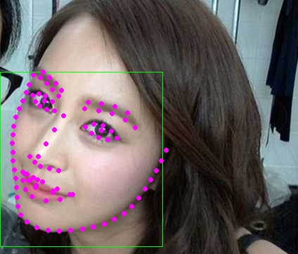

# facelandmarks
light-weight 98 points face landmark超轻98点人脸关键点检测模型

ultra-light-weight 98 face landmarks detection model,only 505k.

超轻量人脸98点关键点检测算法，模型500k+，安卓端测试200fps+（高通855+）

## requirements

```
pytorch
hdface #open source face detecor,pip install hdface
or u could use your own face detector instead of hdface,eg:https://github.com/midasklr/LightWeightFaceDetector
```


## demo

see demo_img.py

## convert to jit and onnx

convert2jit.py

## results




